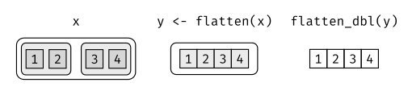
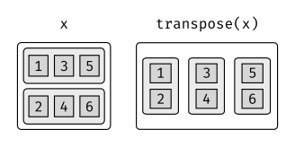

# Hierarchical data {#hierarchy}

## Introduction

This chapter belongs in [wrangle](#wrangle-intro): it will give you a set of tools for working with hierarchical data, such as the deeply nested lists you often get when working with JSON. However, you can only learn it now because working with hierarchical structures requires some programming skills, particularly an understanding of data structures, functions, and iteration. Now you have those tools under your belt, you can learn how to work with hierarchical data.

The

As well as tools to simplify iteration, purrr provides tools for handling deeply nested lists. There are three common sources of such data:

* JSON and XML
*

The map functions apply a function to every element in a list. They are the most commonly used part of purrr, but not the only part. Since lists are often used to represent complex hierarchies, purrr also provides tools to work with hierarchy:

* You can extract deeply nested elements in a single call by supplying
 a character vector to the map functions.

* You can remove a level of the hierarchy with the flatten functions.

* You can flip levels of the hierarchy with the transpose function.

### Prerequisites

This chapter focusses mostly on purrr. As well as the tools for iteration that you've already learned about, purrr also provides a number of tools specifically designed to manipulate hierarchical data.


```r
library(purrr)
```

## Initial exploration

Sometimes you get data structures that are very deeply nested. A common source of such data is JSON from a web API. I've previously downloaded a list of GitHub issues related to this book and saved it as `issues.json`. Now I'm going to load it into a list with jsonlite. By default `fromJSON()` tries to be helpful and simplifies the structure a little for you. Here I'm going to show you how to do it with purrr, so I set `simplifyVector = FALSE`:


```r
# From https://api.github.com/repos/hadley/r4ds/issues
issues <- jsonlite::fromJSON("issues.json", simplifyVector = FALSE)
```

You might be tempted to use `str()` on this data. Unfortunately, however, `str()` is not designed for lists that are both deep and wide, and you'll tend to get overwhelmed by the output. A better strategy is to pull the list apart piece by piece.

First, figure out how many elements are in the list, take a look at one, and then check they're all the same structure. In this case there are eight elements, and the first element is another list.


```r
length(issues)
#> [1] 8
str(issues[[1]])
#> List of 20
#>  $ url         : chr "https://api.github.com/repos/hadley/r4ds/issues/11"
#>  $ labels_url  : chr "https://api.github.com/repos/hadley/r4ds/issues/11/labels{/name}"
#>  $ comments_url: chr "https://api.github.com/repos/hadley/r4ds/issues/11/comments"
#>  $ events_url  : chr "https://api.github.com/repos/hadley/r4ds/issues/11/events"
#>  $ html_url    : chr "https://github.com/hadley/r4ds/pull/11"
#>  $ id          : int 117521642
#>  $ number      : int 11
#>  $ title       : chr "Typo correction in file expressing-yourself.Rmd"
#>  $ user        :List of 17
#>   ..$ login              : chr "shoili"
#>   ..$ id                 : int 8914139
#>   ..$ avatar_url         : chr "https://avatars.githubusercontent.com/u/8914139?v=3"
#>   ..$ gravatar_id        : chr ""
#>   ..$ url                : chr "https://api.github.com/users/shoili"
#>   ..$ html_url           : chr "https://github.com/shoili"
#>   ..$ followers_url      : chr "https://api.github.com/users/shoili/followers"
#>   ..$ following_url      : chr "https://api.github.com/users/shoili/following{/other_user}"
#>   ..$ gists_url          : chr "https://api.github.com/users/shoili/gists{/gist_id}"
#>   ..$ starred_url        : chr "https://api.github.com/users/shoili/starred{/owner}{/repo}"
#>   ..$ subscriptions_url  : chr "https://api.github.com/users/shoili/subscriptions"
#>   ..$ organizations_url  : chr "https://api.github.com/users/shoili/orgs"
#>   ..$ repos_url          : chr "https://api.github.com/users/shoili/repos"
#>   ..$ events_url         : chr "https://api.github.com/users/shoili/events{/privacy}"
#>   ..$ received_events_url: chr "https://api.github.com/users/shoili/received_events"
#>   ..$ type               : chr "User"
#>   ..$ site_admin         : logi FALSE
#>  $ labels      : list()
#>  $ state       : chr "open"
#>  $ locked      : logi FALSE
#>  $ assignee    : NULL
#>  $ milestone   : NULL
#>  $ comments    : int 0
#>  $ created_at  : chr "2015-11-18T06:26:09Z"
#>  $ updated_at  : chr "2015-11-18T06:26:09Z"
#>  $ closed_at   : NULL
#>  $ pull_request:List of 4
#>   ..$ url      : chr "https://api.github.com/repos/hadley/r4ds/pulls/11"
#>   ..$ html_url : chr "https://github.com/hadley/r4ds/pull/11"
#>   ..$ diff_url : chr "https://github.com/hadley/r4ds/pull/11.diff"
#>   ..$ patch_url: chr "https://github.com/hadley/r4ds/pull/11.patch"
#>  $ body        : chr "The discussion of the code in lines 236-243 was a little confusing with x and y so I proposed changing it to a "| __truncated__
```

(In this case we got lucky and the structure is (just) simple enough to print out with `str()`. If you're unlucky, you may need to repeat this procedure.)


```r
tibble::tibble(
 i = seq_along(issues),
 names = issues %>% map(names)
) %>%
 tidyr::unnest(names) %>%
 table() %>%
 t()
#>               i
#> names          1 2 3 4 5 6 7 8
#>   assignee     1 1 1 1 1 1 1 1
#>   body         1 1 1 1 1 1 1 1
#>   closed_at    1 1 1 1 1 1 1 1
#>   comments     1 1 1 1 1 1 1 1
#>   comments_url 1 1 1 1 1 1 1 1
#>   created_at   1 1 1 1 1 1 1 1
#>   events_url   1 1 1 1 1 1 1 1
#>   html_url     1 1 1 1 1 1 1 1
#>   id           1 1 1 1 1 1 1 1
#>   labels       1 1 1 1 1 1 1 1
#>   labels_url   1 1 1 1 1 1 1 1
#>   locked       1 1 1 1 1 1 1 1
#>   milestone    1 1 1 1 1 1 1 1
#>   number       1 1 1 1 1 1 1 1
#>   pull_request 1 1 1 0 0 0 0 0
#>   state        1 1 1 1 1 1 1 1
#>   title        1 1 1 1 1 1 1 1
#>   updated_at   1 1 1 1 1 1 1 1
#>   url          1 1 1 1 1 1 1 1
#>   user         1 1 1 1 1 1 1 1
```

Another alternative is the __listviewer__ package, <https://github.com/timelyportfolio/listviewer>.

## Extracting deeply nested elements

To work with this sort of data, you typically want to turn it into a data frame by extracting the related vectors that you're most interested in:


```r

issues %>% map_int("id")
#> [1] 117521642 110795521 109680972 107925580 107506216  99430051  99430007
#> [8]  99429843
issues %>% map_lgl("locked")
#> [1] FALSE FALSE FALSE FALSE FALSE FALSE FALSE FALSE
issues %>% map_chr("state")
#> [1] "open" "open" "open" "open" "open" "open" "open" "open"
```

You can use the same technique to extract more deeply nested structure. For example, imagine you want to extract the name and id of the user. You could do that in two steps:


```r
users <- issues %>% map("user")
users %>% map_chr("login")
#> [1] "shoili"     "benmarwick" "datalove"   "hadley"     "hadley"    
#> [6] "hadley"     "hadley"     "hadley"
users %>% map_int("id")
#> [1] 8914139 1262179  222907    4196    4196    4196    4196    4196
```

But by supplying a character _vector_ to `map_*`, you can do it in one:


```r
issues %>% map_chr(c("user", "login"))
#> [1] "shoili"     "benmarwick" "datalove"   "hadley"     "hadley"    
#> [6] "hadley"     "hadley"     "hadley"
issues %>% map_int(c("user", "id"))
#> [1] 8914139 1262179  222907    4196    4196    4196    4196    4196
```

What happens if that path is missing in some of the elements? For example, lets try and extract the HTML url to the pull request:


```r
issues %>% map_chr(c("pull_request", "html_url"))
#> Result 4 must be a single string, not NULL of length 0
```

Unfortunately that doesn't work. Whenever you see an error from purrr complaining about the "type" of the result, it's because it's trying to shove it into a simple vector (here a character). You can diagnose the problem more easily if you use `map()`:


```r
issues %>% map(c("pull_request", "html_url"))
#> [[1]]
#> [1] "https://github.com/hadley/r4ds/pull/11"
#> 
#> [[2]]
#> [1] "https://github.com/hadley/r4ds/pull/7"
#> 
#> [[3]]
#> [1] "https://github.com/hadley/r4ds/pull/6"
#> 
#> [[4]]
#> NULL
#> 
#> [[5]]
#> NULL
#> 
#> [[6]]
#> NULL
#> 
#> [[7]]
#> NULL
#> 
#> [[8]]
#> NULL
```

To get the results into a character vector, we need to tell purrr what it should change `NULL` to. You can do that with the `.null` argument. The most common value to use is `NA`:


```r
issues %>% map_chr(c("pull_request", "html_url"), .null = NA)
#> [1] "https://github.com/hadley/r4ds/pull/11"
#> [2] "https://github.com/hadley/r4ds/pull/7" 
#> [3] "https://github.com/hadley/r4ds/pull/6" 
#> [4] NA                                      
#> [5] NA                                      
#> [6] NA                                      
#> [7] NA                                      
#> [8] NA
```

(You might wonder why that isn't the default value since it's so useful. Well, if it was the default, you'd never get an error message if you had a typo in the names. You'd just get a vector of missing values. That would be annoying to debug because it's a silent failure.)

It's possible to mix position and named indexing by using a list


```r
issues %>% map_chr(list("pull_request", 1), .null = NA)
#> [1] "https://api.github.com/repos/hadley/r4ds/pulls/11"
#> [2] "https://api.github.com/repos/hadley/r4ds/pulls/7" 
#> [3] "https://api.github.com/repos/hadley/r4ds/pulls/6" 
#> [4] NA                                                 
#> [5] NA                                                 
#> [6] NA                                                 
#> [7] NA                                                 
#> [8] NA
```


## Removing a level of hierarchy

As well as indexing deeply into hierarchy, it's sometimes useful to flatten it. That's the job of the flatten family of functions: `flatten()`, `flatten_lgl()`, `flatten_int()`, `flatten_dbl()`, and `flatten_chr()`. In the code below we take a list of lists of double vectors, then flatten it to a list of double vectors, then to a double vector.


```r
x <- list(list(a = 1, b = 2), list(c = 3, d = 4))
str(x)
#> List of 2
#>  $ :List of 2
#>   ..$ a: num 1
#>   ..$ b: num 2
#>  $ :List of 2
#>   ..$ c: num 3
#>   ..$ d: num 4

y <- flatten(x)
str(y)
#> List of 4
#>  $ a: num 1
#>  $ b: num 2
#>  $ c: num 3
#>  $ d: num 4
flatten_dbl(y)
#> [1] 1 2 3 4
```

Graphically, that sequence of operations looks like:



Whenever I get confused about a sequence of flattening operations, I'll often draw a diagram like this to help me understand what's going on.

Base R has `unlist()`, but I recommend avoiding it for the same reason I recommend avoiding `sapply()`: it always succeeds. Even if your data structure accidentally changes, `unlist()` will continue to work silently the wrong type of output. This tends to create problems that are frustrating to debug.

## Switching levels in the hierarchy {#transpose}

Other times the hierarchy feels "inside out". You can use `transpose()` to flip the first and second levels of a list:


```r
x <- list(
 x = list(a = 1, b = 3, c = 5),
 y = list(a = 2, b = 4, c = 6)
)
x %>% str()
#> List of 2
#>  $ x:List of 3
#>   ..$ a: num 1
#>   ..$ b: num 3
#>   ..$ c: num 5
#>  $ y:List of 3
#>   ..$ a: num 2
#>   ..$ b: num 4
#>   ..$ c: num 6
x %>% transpose() %>% str()
#> List of 3
#>  $ a:List of 2
#>   ..$ x: num 1
#>   ..$ y: num 2
#>  $ b:List of 2
#>   ..$ x: num 3
#>   ..$ y: num 4
#>  $ c:List of 2
#>   ..$ x: num 5
#>   ..$ y: num 6
```

Graphically, this looks like:



You'll see an example of this in the next section, as `transpose()` is particularly useful in conjunction with adverbs like `safely()` and `quietly()`.

It's called transpose by analogy to matrices. When you subset a transposed matrix, you switch indices: `x[i, j]` is the same as `t(x)[j, i]`. It's the same idea when transposing a list, but the subsetting looks a little different: `x[[i]][[j]]` is equivalent to `transpose(x)[[j]][[i]]`. Similarly, a transpose is its own inverse so `transpose(transpose(x))` is equal to `x`.

Transpose is also useful when working with JSON APIs. Many JSON APIs represent data frames in a row-based format, rather than R's column-based format. `transpose()` makes it easy to switch between the two:


```r
df <- tibble::tibble(x = 1:3, y = c("a", "b", "c"))
df %>% transpose() %>% str()
#> List of 3
#>  $ :List of 2
#>   ..$ x: int 1
#>   ..$ y: chr "a"
#>  $ :List of 2
#>   ..$ x: int 2
#>   ..$ y: chr "b"
#>  $ :List of 2
#>   ..$ x: int 3
#>   ..$ y: chr "c"
```

## Turning lists into data frames

* Have a deeply nested list with missing pieces
* Need a tidy data frame so you can visualise, transform, model etc.
* What do you do?
* By hand with purrr, talk about `fromJSON` and `tidyJSON`
* tidyjson

### Exercises

1. Challenge: read all the CSV files in a directory. Which ones failed
 and why?

 
 ```r
 files <- dir("data", pattern = "\\.csv$")
 files %>%
 set_names(., basename(.)) %>%
 map_df(safely(readr::read_csv), .id = "filename") %>%
 ```
